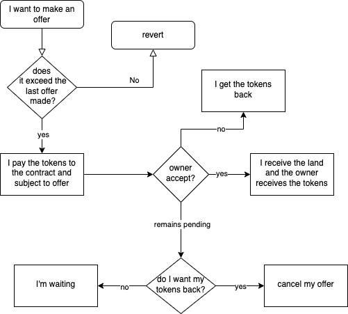
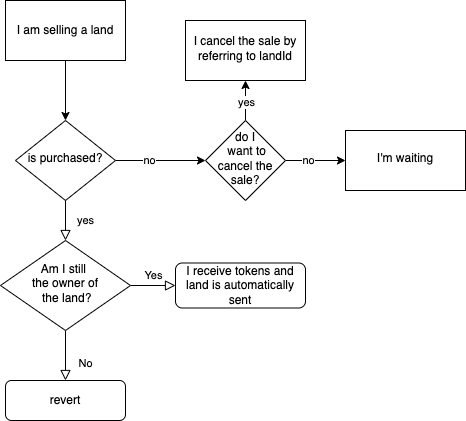
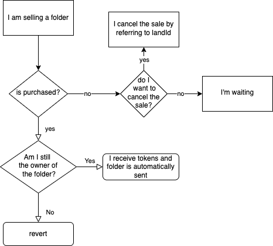

Repository of all smart contracts deployed on polygon:
- `OVRLand.sol`
- `LightMint.sol`
- `OVRLandContainer.sol`
- `OVRMarketplace.sol`
## Installation

```js
// clone this project
nvm use
npm install
```

### 🔑 ENV

Create an `.env` file on root. Take a look to `.env.example`

```
PRIVATE_KEY = ""
ETHERSCAN_API_KEY = ""
ALCHEMY_KEY = ""
MORALIS_KEY = ""
```

# OVRLand
The ERC721 OVRLand contract uses AccessControl from openzeppelin to assign specific roles based on the functions that are called. The roles are:

1. `DEFAULT_ADMIN_ROLE`: May assign or revoke roles.
2. `MINTER_ROLE`: Can perform mint and batchMint
3. `BURNER_ROLE`: It should not be used
4. `LAND_URI_EDITOR_ROLE`: It can modify the URI of the token. This role exists because later a smart contract will be developed that has the ability to change the URI of the experience (metadata) loaded on the land.


### ➡️ DEPLOY

```
npx hardhat run scripts/deploy.js --network mumbai
```
For production use `matic-mainnet` as network.

### 🔨 MINTING
```js
// REMEBER TO UPDATE OVRLand contractAddress on the top of script
npx hardhat run scripts/batch-mint-lands.js --network mumbai
```

### 🔨 MINTING WITH URI
```js
// REMEBER TO UPDATE OVRLand contractAddress on the top of script
npx hardhat run scripts/batch-mint-lands-with-uri.js --network mumbai
```


# LightMint
Allows users to independently mint lands if they are eligible.

### ➡️ DEPLOY
```
npx hardhat run scripts/deploy-light-mint.js --network mumbai
```
For production use `matic-mainnet` as network.


# OVRLandContainer 

OVRLandContainer is the token representative of the containers containing OVRLands.

Anyone who has at least 2 lands can create a container by calling the `createContainer` function passing the landId of the lands that the container will contain, lands will be transfered from the caller to the contract, and a OVRLandContainer token will be minted to caller.
This function can be called from the owner of the OVRLand tokens only if lands aren't on selling or on renting inside marketplace contract and renting contract.

The owner of a container can remove or add lands inside the container by calling `addLandToContainer` and `removeLandFromContainer` functions passing the landId to be added/removed and the destination containerId.

The owner of a container can also destroy owned container by calling `deleteContainer` function passing the containerid, it will return to the owner all the lands that were inside the container and will burn the container token.

`addLandToContainer`, `removeLandToContainer` and `deleteContainer` can be called only if the container isn't on selling or on renting inside marketplace contract and renting contract.

Trough the `ownerOfChild` function passing a landId it's possible to see the owner of a land that is inside a container.

Calling the `childsOfParent` function passing a containerId it's possible to see all the lands inside a container.

OVRLandContainer follow the ERC721 standard so there are all the standard functions like `transferFrom`, `transfer`, etc..

### ➡️ DEPLOY

```
npx hardhat run scripts/deploy-container.js --network mumbai
```
For production use `matic-mainnet` as network.


### ↩️ UPGRADE

```
npx hardhat run scripts/upgrade-container.js --network mumbai
```


# Secondary Marketplace

The marketplace has 3 different types of purchase and sale:

- **Offer**: anyone can make offers to buy any land, it will be the owner who decides whether to accept, reject or keep them pending.
- **Direct Sale for Land**: the owner of a land can sell their land and anyone can buy it by paying the amount set by the owner + taxes
- **Direct Sale by Container**: the owner of land can sell containers and anyone can buy them by paying the amount set by the owner + taxes.

## OFFERS

Anyone can bid on an existing land, even if the land are for sale alone or in a container, by calling the function `placeOffer` and pass the landId and the price of the bid multiplied to 1e18, all the tokens bidded will be transfered inside the marketplace contract.

The owner of the land can accept the offer calling the function `acceptOffer` and passing the landId, it will send the fee to the feeReciver, the land to the buyer and the amount to the land owner.



## Direct sale for Land
The owner of a land can put their land up for sale and anyone can buy it by paying the amount set by the owner + taxes, each land can be offered for sale only once at a time, alone or in a container.

The land can be put for sale by calling the function `sell`, passing the landId and the price multiplied to 1e18.

The buyer can buy the land by calling the function `buy` and passing the landId, it will send the fee to the feeReciver, the land to the buyer and the amount to the land owner



## Direct Sale by container
The owner of a container can put the container up for sale and anyone can buy it by paying the amount set by the owner + taxes

The container can be put for sale by calling the function `sellContainer`, passing the containerId and the price multiplied to 1e18.

The buyer can buy the container by calling the function `buyContainer` and passing idContainer, it will send the fee to the feeReciver, the container to the buyer and the amount to the seller.


## `onSelling()` and `onSellingContainer()` modifiers
Will check if anyone the person that put up the land or the container for sale, is the currently owner.

### *why?*

Because lands can be sold outside of our smart contracts.

Without these modifiers someone can sell his lands both on our market and outside, and one of the two buyers would not receive them because the lands have already been sold, instead with these modifiers if the one who is selling the lands is the current owner of the land at the time of purchase means that the land has not been sold or transferred outside of our contract.

### ➡️ DEPLOY

```
npx hardhat run scripts/deploy-marketplace.js --network mumbai
```
For production use `matic-mainnet` as network.


### ↩️ UPGRADE

```
npx hardhat run scripts/upgrade-marketplace.js --network mumbai
```


----

## Advanced Sample Hardhat Project

This project demonstrates an advanced Hardhat use case, integrating other tools commonly used alongside Hardhat in the ecosystem.

The project comes with a sample contract, a test for that contract, a sample script that deploys that contract, and an example of a task implementation, which simply lists the available accounts. It also comes with a variety of other tools, preconfigured to work with the project code.

Try running some of the following tasks:

```shell
npx hardhat accounts
npx hardhat compile
npx hardhat clean
npx hardhat test
npx hardhat node
npx hardhat help
REPORT_GAS=true npx hardhat test
npx hardhat coverage
npx hardhat run scripts/deploy.js
node scripts/deploy.js
npx eslint '**/*.js'
npx eslint '**/*.js' --fix
npx prettier '**/*.{json,sol,md}' --check
npx prettier '**/*.{json,sol,md}' --write
npx solhint 'contracts/**/*.sol'
npx solhint 'contracts/**/*.sol' --fix
```

## 📝 ETHERSCAN VERIFICATION

To try out Etherscan verification, you first need to deploy a contract to an Ethereum network that's supported by Etherscan, such as Ropsten.

In this project, copy the .env.example file to a file named .env, and then edit it to fill in the details. Enter your Etherscan API key, your Ropsten node URL (eg from Alchemy), and the private key of the account which will send the deployment transaction. With a valid .env file in place, first deploy your contract:

```shell
hardhat run --network ropsten scripts/deploy.js
```

Then, copy the deployment address and paste it in to replace `DEPLOYED_CONTRACT_ADDRESS` in this command:

```shell
npx hardhat verify --network ropsten DEPLOYED_CONTRACT_ADDRESS "Hello, Hardhat!"
```

## Mumbai testnet addresses

- OVRLand: 0x771468b89d8218d7f9b329DFbf4492320Ce28b8d
- OVRLand Container: 0x1a5006044D89e73919239e7dc3455cF5512CBC27
- OVRMarketplace: 0x54b461C78B88c498989551Be6ef5e3b8F4f8d123